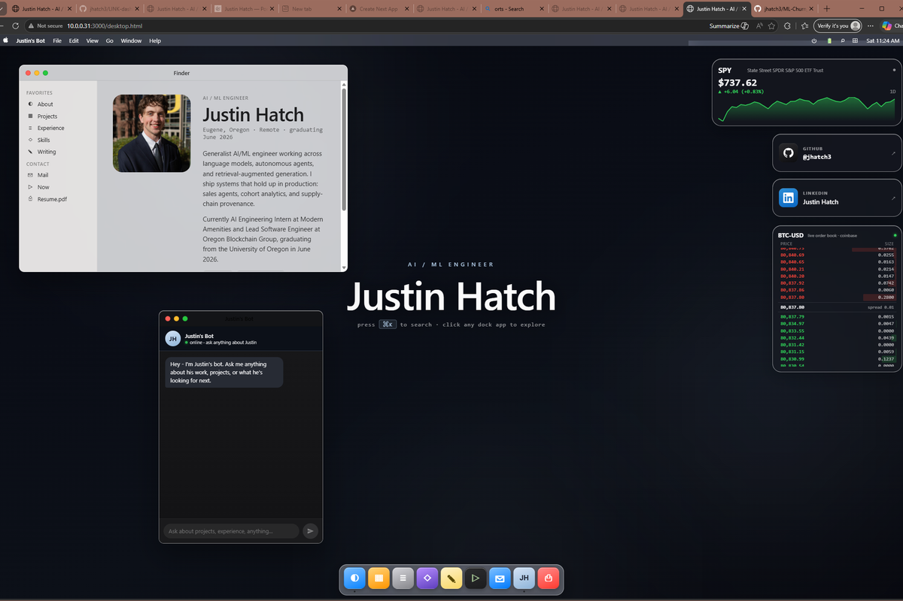

<div align="center">

# Justin Hatch — Portfolio

<a href="https://justin-portfolio-e819.onrender.com">
  
</a>

**A personal portfolio that's also a working macOS desktop, a streaming Claude chatbot, a live order book, an iOS home screen on phones, and a set of agent skills that let me update the site with a single slash command.**

[**Live site →**](https://justin-portfolio-e819.onrender.com) &nbsp;·&nbsp; [**Interactive mode →**](https://justin-portfolio-e819.onrender.com/desktop) &nbsp;·&nbsp; [Resume](Resume.pdf)


-06b6d4?logo=tailwindcss&logoColor=fff)


</div>

---

## What's inside

| Surface | What it is |
|---|---|
| **`/` Landing page** | Traditional resume-style portfolio: hero, experience, projects, education, writing, skills, embedded PDF, contact. Light theme with navy ink and an animated `FlipWords` tagline. |
| **`/desktop` Interactive mode** | Full macOS desktop simulation — draggable, resizable windows; dock magnification on hover; ⌘K spotlight; traffic lights; frosted glass everything. Each portfolio section is a window. |
| **iOS home screen (mobile)** | Viewports under 600×500 get a faithful iOS home screen at `/desktop` — apps in a 4-col grid, frosted dock, status bar, tap-to-open detail sheets. Same React tree, branched at the root. |
| **Justin's Bot** | Streaming Claude chatbot living in a window. Anthropic SDK + SSE deltas, prompt caching, sliding 24h rate limit. Hardened against 12+ prompt-injection vectors with a built-in red-team suite. |
| **Live data widgets** | Real Yahoo Finance stock ticker (server-proxied), Coinbase Level-2 WebSocket order book, GitHub + LinkedIn tiles. |
| **Agent skills** | Six Claude Code skills (`/portfolio-projects`, `/portfolio-experience`, `/portfolio-now`, `/portfolio-writing`, `/portfolio-skills`, `/portfolio-education`) that CRUD the portfolio from any cwd, commit, and push. From inside another GitHub repo, `/portfolio-projects add this repo` scrapes its metadata and adds it as a project automatically. |

---

## Quick start

```bash
# 1. Configure secrets
cp .env.example .env
# Edit .env and paste your ANTHROPIC_API_KEY

# 2. Install backend deps
cd server
npm install

# 3. Run
npm start
```

Open <http://localhost:3000>.

The server prints LAN URLs at startup so you can hit it from your phone on the same Wi-Fi:

```
[server] for iPhone / other devices on this Wi-Fi:
[server]   http://192.168.x.y:3000     (Wi-Fi)
```

### Red-team the chatbot

```bash
cd server
npm run grill
```

Hammers `/api/chat` with 12 adversarial prompts (jailbreaks, prompt-injections, identity probes, off-topic baits) and reports pass/fail.

---

## Agent skills

Each skill edits one file in `data/` and auto-commits + pushes. Both the landing page and the desktop sim read from the same data files, so any edit propagates everywhere with one push.

```
/portfolio-projects add Sales Agent for Modern Amenities, stack Claude/FastAPI/Tool Use
/portfolio-projects update crop-share status=shipped
/portfolio-projects remove project-5
/portfolio-projects list

/portfolio-experience add AI Engineering Intern at Modern Amenities, started Mar 2026
/portfolio-experience update modern amenities add bullet "Shipped v1 to 12 enterprise customers"

/portfolio-now add Reading: The Pragmatic Programmer
/portfolio-now reorder reading top

/portfolio-writing add "How I cut Claude inference 3× via prompt caching" — 6 min — Technical Report
/portfolio-skills add "AI Engineering" pgvector
/portfolio-education add bullet 2026 "Won the Hackathon X grand prize"
```

Skills live at `~/.claude/skills/portfolio-{projects,experience,now,writing,skills,education}/`, with the portfolio path hard-coded so they work from anywhere. From inside any other GitHub repo:

```
/portfolio-projects add this repo
```

reads the current `git remote`, fetches the repo's GitHub metadata, builds a project entry, and pushes the portfolio.

---

## Tech stack

**Frontend** &nbsp;React 18 (UMD) · Babel-in-browser JSX · Tailwind v3 (Play CDN) · Inter / JetBrains Mono · Framer-Motion-style CSS keyframes

**Backend** &nbsp;Node 20 · Express 4 · Anthropic SDK · `@anthropic-ai/sdk` streaming with `cache_control: ephemeral`

**Live data** &nbsp;Yahoo Finance v8 (proxied) · Coinbase WebSocket level2 feed

**Deploy** &nbsp;Render (long-lived Node process for SSE) · GitHub auto-deploy on push to `main` · `render.yaml` blueprint

---

## Architecture

```
/                                Static frontend (no build step)
  landing.html                   Public landing page (/) — hero, sections, embed
  desktop.html                   macOS sim (/desktop) — mounts the window manager
  desktop.jsx                    Wallpaper, menubar, dock, draggable + resizable windows, spotlight
  apps.jsx                       Per-window content (Finder/About, Projects, Experience, Skills, etc.)
  widgets.jsx                    Stock ticker, GitHub + LinkedIn tiles, Coinbase order book
  mobile.jsx                     iOS home screen + per-app sheets for phones
  data/
    profile.js                   identity, links, about, certs, honors
    projects.js                  13 portfolio projects with bullets + tags + images
    experience.js                4 roles with bullets
    education.js                 4 academic milestones
    skills.js                    7 categorized skill groups
    writing.js                   3 articles / reports / dashboards
    now.js                       5 'what I'm doing right now' lines
  images/projects/               1200×800 (3:2) images for each project card
  Resume.pdf

/server                          Express backend
  index.mjs                      /api/chat (SSE streaming), /api/quote (Yahoo proxy), static serving, LAN-print
  system-prompt.mjs              Identity-pinned, override-resistant system prompt with prompt-cache markers
  load-data.mjs                  Loads data/*.js into Node so the bot reads the same content
  grill.mjs                      Red-team test suite (12 adversarial prompts)
  package.json                   { @anthropic-ai/sdk, express, dotenv }

/.github                         Render auto-deploy on push (no Actions yet)
render.yaml                      Render blueprint: build, start, env vars

next-app/                        Phase-2 Next.js 16 + Tailwind v4 + TypeScript scaffold
                                 (where shadcn/Aceternity components paste in cleanly)
```

## Deployment

Render auto-deploys on every push to `main` via [`render.yaml`](render.yaml).

```yaml
services:
  - type: web
    name: justin-hatch-portfolio
    runtime: node
    plan: free
    buildCommand: cd server && npm install
    startCommand: cd server && npm start
    healthCheckPath: /api/health
```

The free tier sleeps after 15 min of inactivity (~30s cold start). Upgrade to Starter ($7/mo) for always-on. SSE streaming works natively because Render runs a long-lived Node process — Vercel-style serverless functions need a different shape.

---

## Roadmap

- Migrate to **Next.js 16 + Tailwind v4 + shadcn/ui** (scaffold already at `next-app/`)
- Migrate Express endpoints to **Next.js API routes** for one-runtime deploys
- Add **light-mode toggle** for the desktop sim
- Real-time **GitHub contribution graph** widget
- Persist chatbot conversation in `localStorage` so refreshes don't wipe context

---

## License

[MIT](LICENSE) © 2026 Justin Hatch.
